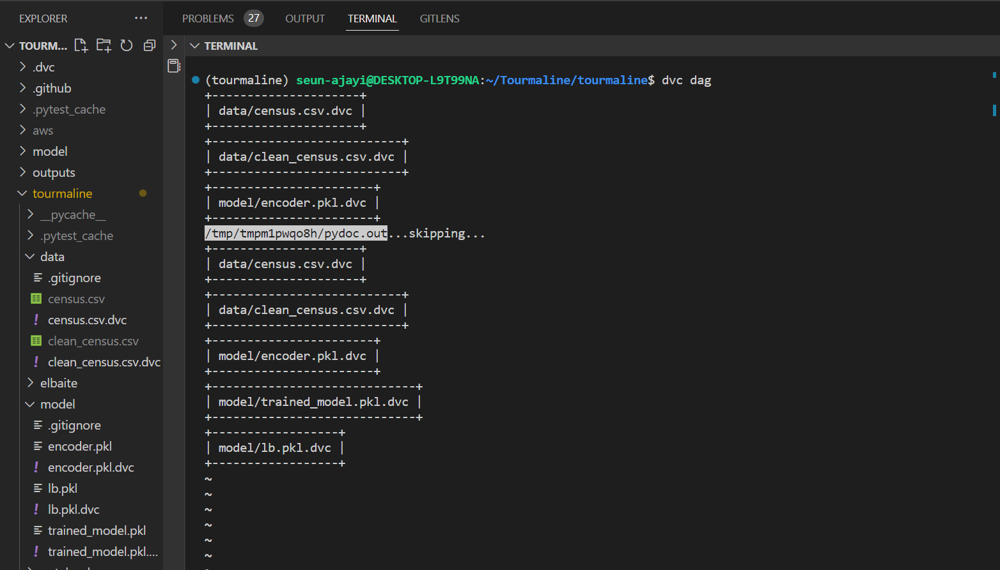
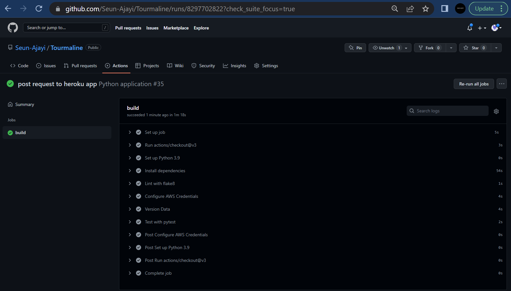
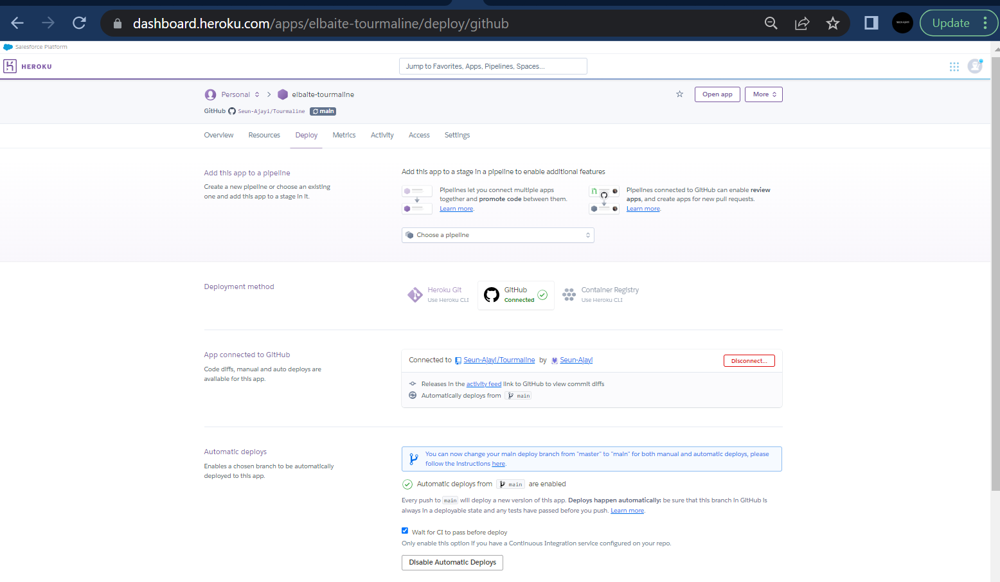
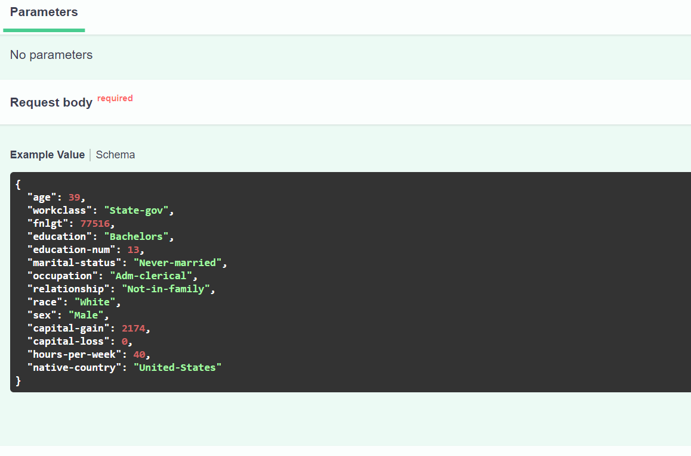
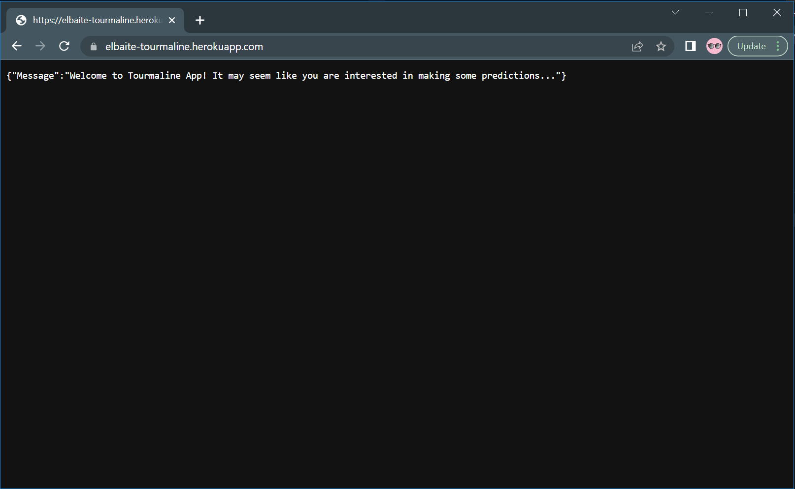
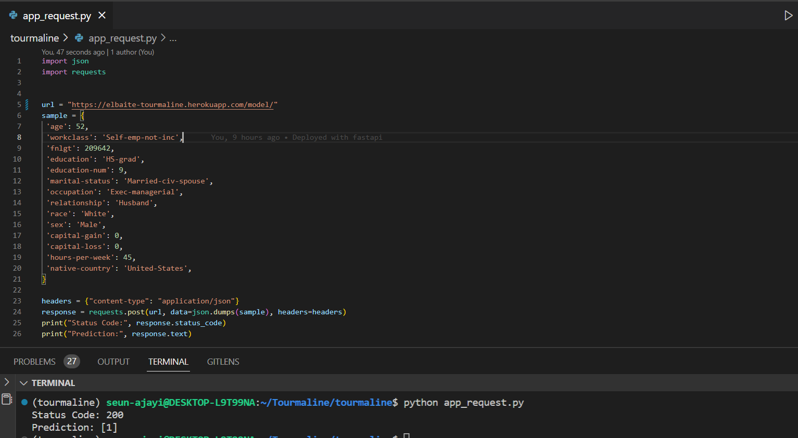

# Tourmaline

## Overview
This project builds a classification system based on the Census Bureau data and deploys to Heroku. You may view it
here: [Tourmaline App](https://elbaite-tourmaline.herokuapp.com).

This project features:
- DVC to version data and artifacts (model, encoders etc). See [DVC Config]
- Github Actions
- FastAPI.
- Continuous deployment to Heroku

See [Outputs](#outputs) for required screenshots.

## Outputs
### DVC Dag

### Continuous Integration

### Continuous Deployment

### FastAPI Docs

### Get Request

### Post Request

